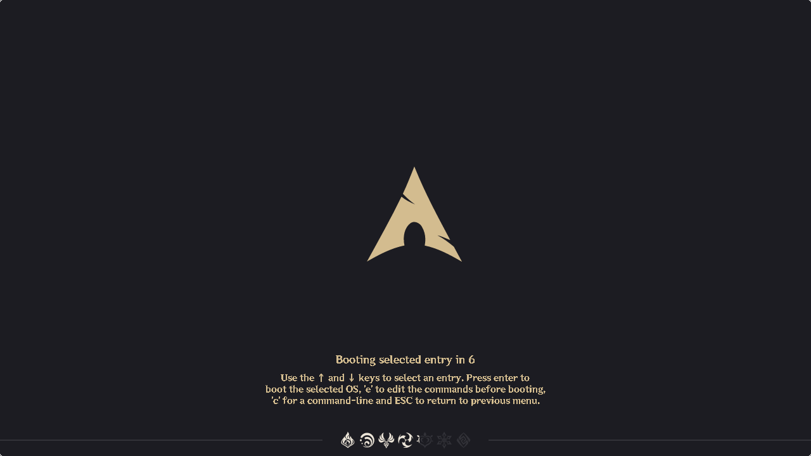
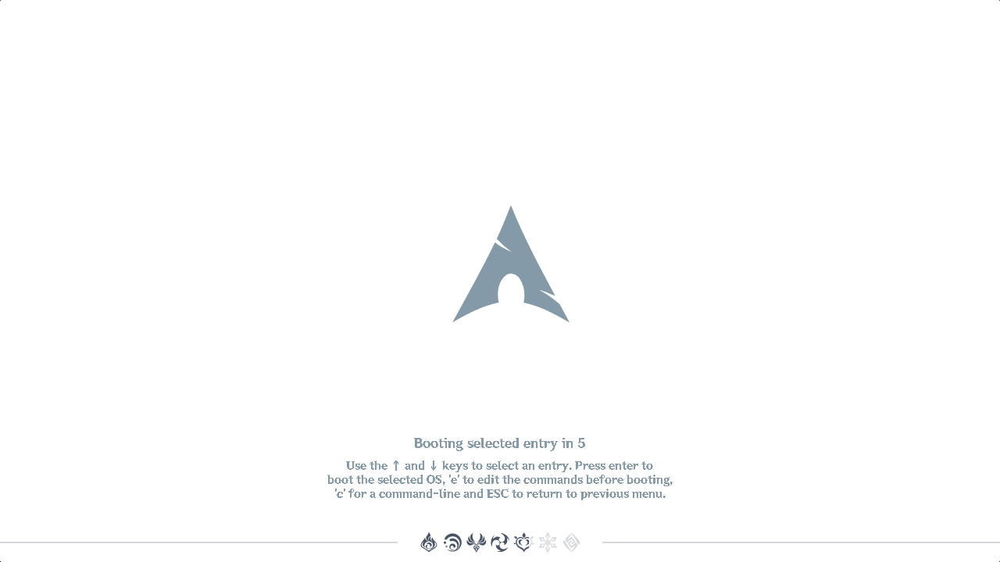
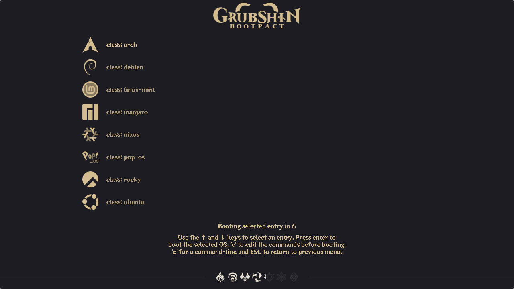
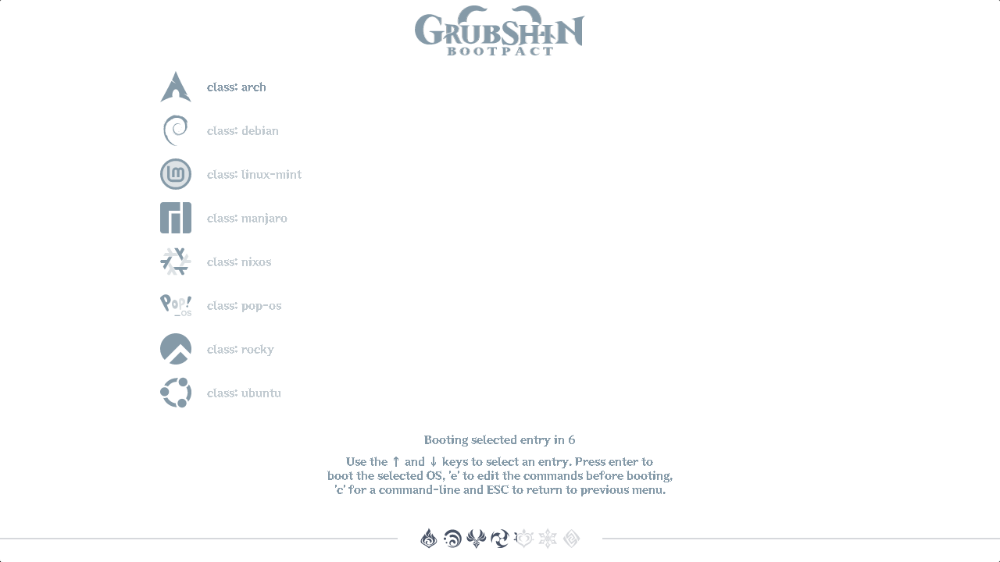

# Grubshin Bootpact

A GRUB theme inspired by Genshin Impact's teleportation loading screen.

## Features

- "Teleport" into your linux distribution from GRUB
- 2 layouts: Classic look from theme version 0.0.1 and a more similar layout to the loading screen.
- 3 color schemes: Day & Night from the game and Abyss - black and white look from the 0.0.1 release.
- A font from the game
- The boot countdown is an elemental loading bar from the game
- Icon set of several Linux Distribution's logos, recolored to fit in with the vibe of the region icons in game.
- Support for 1080p and 720p monitors

## Showcase

View the large images at <a href="SHOWCASE.md#screenshots">SHOWCASE.md</a>

<table>
<tr>
  <th>
    
  </th><th>
    
  </th><th>
    
  </th><th>
    
  </th><th>
    
  </th>
</tr>
</table>

## Installation

Instructions documented in [INSTALLATION.md](INSTALLATION.md).
