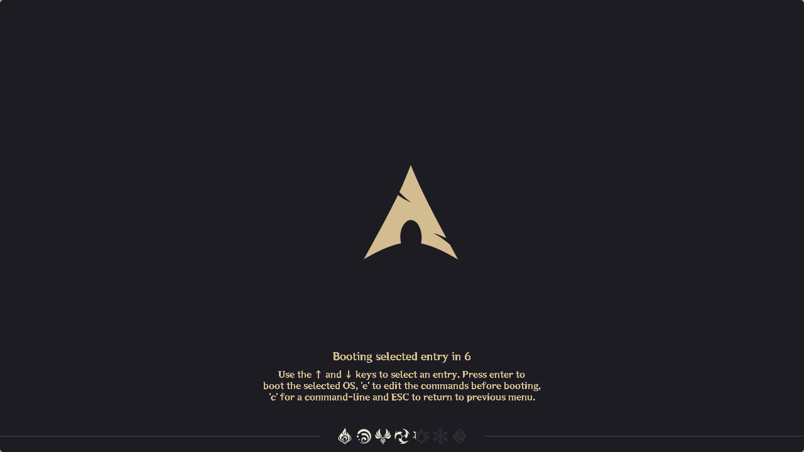
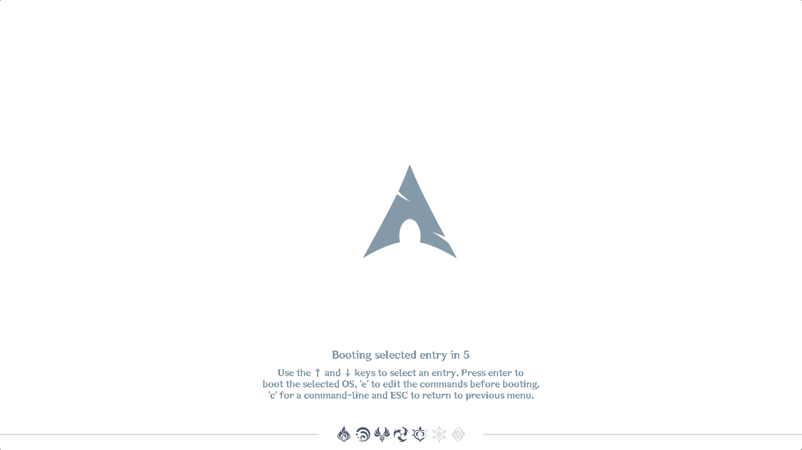
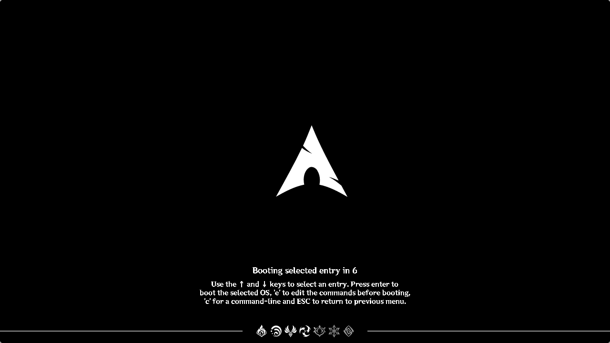
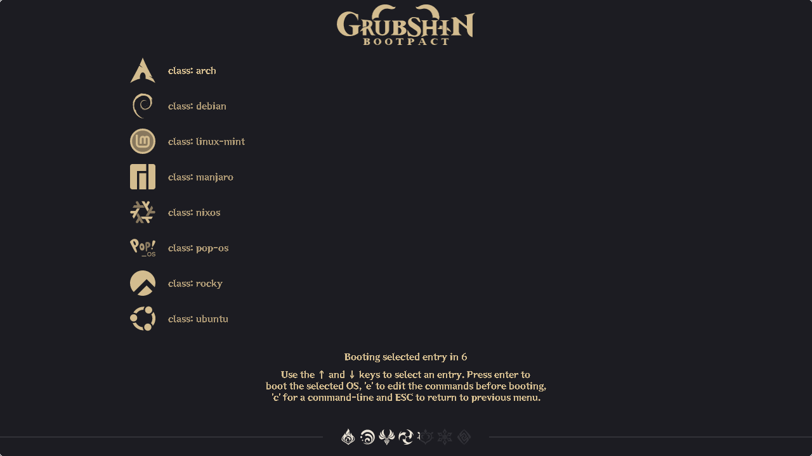
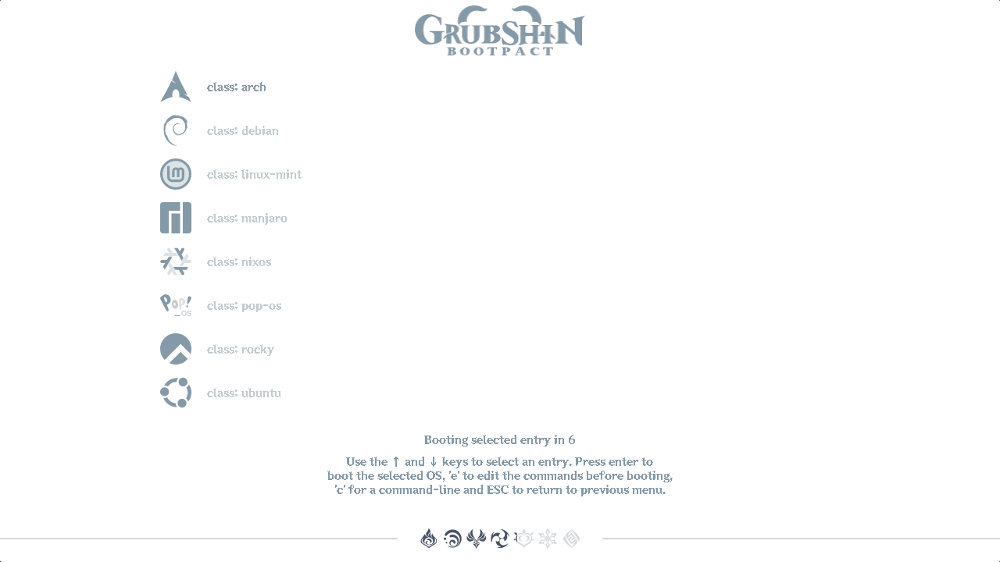
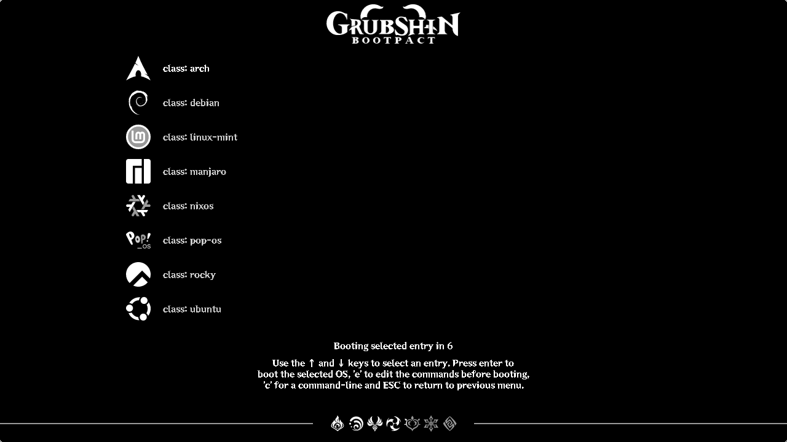

# Theme showcase

> [!NOTE]
> Scroll down for screenshots.

## Supported resolutions

| `nix build` | Common name |
|-------------|-------------|
| 1280x720    | 720p        |
| 1980x1080   | 1080p       |

## Colorschemes

| `nix build` | Name      | Description                                              |
|-------------|-----------|----------------------------------------------------------|
| night       | **Night** | The dark version of the in-game loading screen.          |
| day         | **Day**   | The light version of the in-game loading screen.         |
| abyss       | **Abyss** | The 0.0.1 colorscheme - pitch black, just like the void. |

## Layouts

| `nix build` | Name         | Description                                                                                |
|-------------|--------------|--------------------------------------------------------------------------------------------|
| classic     | **Classic**  | A touched up version of the 0.0.1 look. Very convinient to use with multiple boot entries. |
| teleport    | **Teleport** | Very similar to classic, but mimics the teleport loading screen a lot better.              |

## Screenshots

### Teleport (Night)

### Teleport (Day)

### Teleport (Abyss)

### Classic (Night)

### Classic (Day)

### Classic (Abyss)

